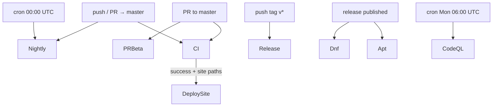
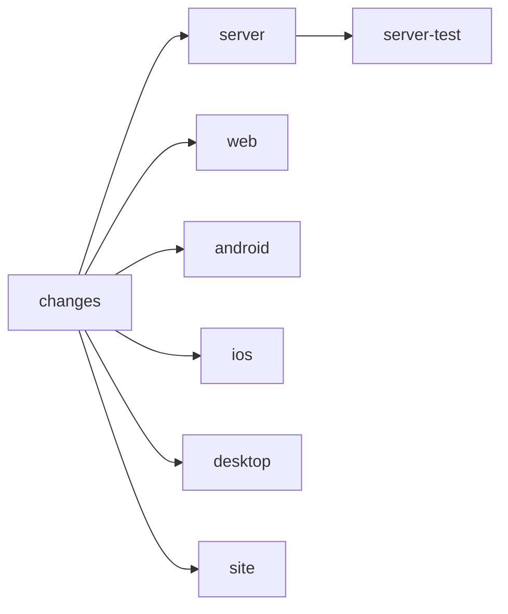
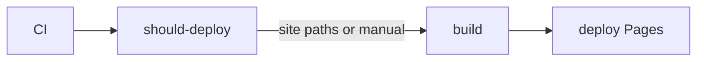
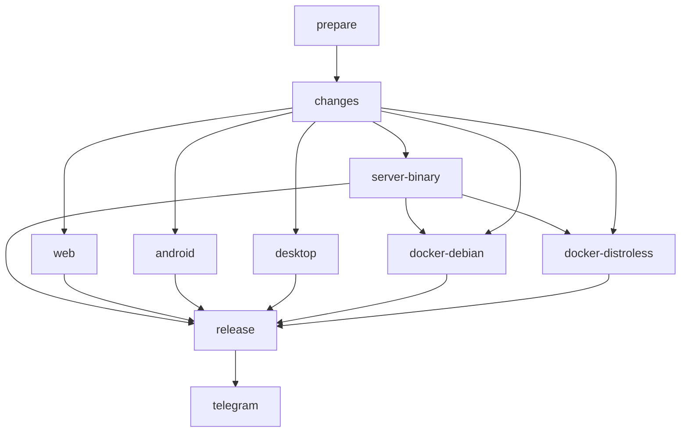
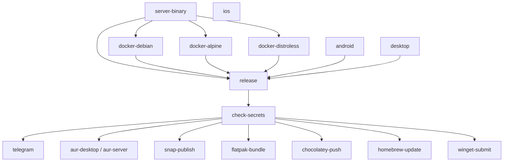

# CI/CD pipelines

Source of truth: `.github/workflows/`. This page summarizes **what each workflow does**, **when it runs**, **job deps**, and **path filters**.

---

## Overview



| Workflow | File | Trigger | Purpose |
|----------|------|---------|---------|
| **CI** | `ci.yml` | push/PR → `master` | Lint/test/build per app (path-filtered) |
| **Deploy Site** | `deploy-site.yml` | after CI success on `master`, or manual | GitHub Pages (landing + docs) |
| **Dev & Nightly** | `dev-nightly.yml` | push → `master`, or nightly cron | Pre-release artifacts + GHCR |
| **Release** | `release.yml` | tag `v*` | Full production release |
| **PR Beta** | `pr-beta.yml` | PR open/sync/reopen/close | Per-PR beta assets |
| **CodeQL** | `codeql.yml` | push/PR + weekly | Security analysis |
| **Apt repo** | `apt-repo.yml` | release published | `.deb` apt index on Pages |
| **DNF repo** | `dnf-repo.yml` | release published | `.rpm` dnf index |

There is **no** auto SSH deploy to a production host (`deploy-server.yml` removed).

---

## Path filters (what runs when)

Used by **CI**, **Deploy Site**, and **Dev/Nightly**. Compare changed files to previous commit (or last `nightly-*` on schedule).

| Flag / job group | Paths that enable it |
|------------------|----------------------|
| **server** | `server/**` |
| **web** | `apps/web/**` (meeting UI; embedded in binary) |
| **site** | `apps/site/**`, **`docs/**`**, `server/**` (swagger), related workflow files |
| **android** | `apps/android` (submodule pointer), `apps/android/**` |
| **desktop** | `apps/desktop/**`, `Cargo.toml`, `Cargo.lock` |
| **ios** | `apps/ios/**` |
| **docker** (nightly only) | `server/**`, `apps/web/**`, `Dockerfile` |
| **product** (nightly publish) | server, web, android, desktop, Dockerfile — **not** `docs/` or `apps/site` alone |

`apps/android` is a git submodule pointing at [bedrud-android](https://github.com/themadorg/bedrud-android) (source lives there now). The filter matches both the bare `apps/android` gitlink entry (so bumping the pinned commit triggers the job) and `apps/android/**` (belt-and-suspenders).

**Important examples**

| Change set | CI jobs | Nightly publish | Pages deploy |
|------------|---------|-----------------|--------------|
| Only `docs/**` | **site only** | **nothing product** | yes (if CI succeeded) |
| Only `apps/site/**` | site only | nothing product | yes |
| Only `apps/web/**` | web | server+web+docker (server binary needed for image) | no* |
| Only `server/**` | server + site | server + docker | yes (swagger) |
| Only `apps/android/**` | android | android (+ whatever else filtered) | no* |

\*Unless `server/` or `apps/site/` / `docs/` also changed.

**Trees**

- `apps/web` → product UI inside `bedrud` / Docker  
- `apps/site` → bedrud.org landing + user docs (Pages)  
- `docs/` → **repo** developer markdown (this tree); does **not** build the Go binary  

---

## CI (`ci.yml`)

**When:** push or PR to `master`.



Jobs run only if their path flag is true (except `changes`, always).

### `changes`

- Checkout + `dorny/paths-filter` → outputs: `server`, `web`, `site`, `android`, `desktop`, `ios`

### `server` (if `server`)

- Setup Go 1.26  
- Placeholder `frontend/` + LiveKit bin for `//go:embed`  
- `go vet ./...`  
- `go build ./...`

### `server-test` (if `server`, needs `server`)

- Same placeholders  
- `go test -race -count=1 ./...`

### `web` (if `web`)

- Bun install  
- `bun run check`  
- `bun run build`

### `android` (if `android`)

- Checkout with `submodules: recursive` (pulls the pinned bedrud-android commit)
- Java 17 + Gradle 9.5  
- `lint` → unit tests → `assembleDebug` / `bundleDebug`  
- Upload APKs/AAB (7-day artifacts)

### `ios` (if `ios`) — `macos-15`

- SPM resolve  
- `build-for-testing` + `test-without-building` (simulator)  
- Coverage report artifact

### `desktop` (if `desktop`)

- Rust stable + Linux Slint deps  
- `cargo build -p bedrud-desktop`  
- `cargo test -p bedrud-desktop`

### `site` (if `site`)

- Bun install  
- Copy `server/docs/swagger.json` → `public/`  
- `check` → `typecheck:astro` → `build`

---

## Deploy Site (`deploy-site.yml`)

**When:** CI completed on `master`, or manual `workflow_dispatch`.



- **should-deploy:** if CI success (or manual); path check includes `apps/site/`, `docs/`, `server/`, deploy/ci workflow files  
- **build** (if site needed): GPG key export (optional secrets) → sync swagger → Astro build  
- **deploy:** `actions/deploy-pages`  

Manual dispatch always deploys.

---

## Dev & Nightly (`dev-nightly.yml`)

**When:** push to `master`, or cron `0 0 * * *` (UTC).

**Channels**

- Push → tag `dev-<sha7>`, Docker tag `dev`  
- Schedule → tag `nightly-YYYYMMDD`, Docker tag `nightly`  
- Nightly aborts in `prepare` if HEAD == last `nightly-*` tip (no new commits)



### Job conditions

| Job | Runs when |
|-----|-----------|
| `prepare` | always (on trigger) |
| `changes` | after prepare |
| `server-binary` | `server` **or** `docker` paths |
| `web` | `web` paths |
| `docker-*` | `docker` paths (needs server-binary) |
| `android` / `desktop` | their paths |
| `release` | `product == true` **and** at least one of server/web/android/desktop/docker succeeded; skipped jobs OK |
| `telegram` | release succeeded |

**docs-only / site-only push:** `product=false` → **no** server/web/docker/android/desktop/release.

### `server-binary` (matrix: linux/amd64, linux/arm64, windows/amd64)

- Embed frontend (`apps/web` build:embed)  
- Download LiveKit, static link via Zig  
- Package `.tar.xz` / `.deb` / Windows zip  

### `docker-debian` / `docker-distroless`

- Download linux server artifacts  
- Multi-arch push to `ghcr.io/<repo>`  

### `android` / `desktop`

- Build + upload installers/APKs (desktop matrix: Linux/Windows/macOS arches)

### `web`

- `bun run build` → `web.tar.xz` artifact  

### `release`

- Download artifacts that exist  
- GitHub prerelease with dynamic asset list  
- Only lists Android/Desktop/Docker if those jobs ran  

### `telegram`

- Notify if release succeeded (server/web always mentioned; optional clients noted as path-gated)

---

## Release (`release.yml`)

**When:** push tag `v*`. **No path filters** — full matrix.



- **server-binary:** multi-OS packages + deb/rpm  
- **docker-\*:** push GHCR + offline `.tar.gz`  
- **android / ios / desktop:** full client builds (signing when secrets present)  
- **release:** GitHub Release with all artifacts  
- **Downstream** (secret-gated): Telegram, AUR, Snap, Flatpak, Chocolatey, Homebrew, WinGet  

---

## PR Beta (`pr-beta.yml`)

**When:** PR to `master` (open/sync/reopen/close). **Not path-filtered.**

- **closed:** delete PR beta release  
- **else:** build server (linux), android, web, desktop → prerelease `pr-<n>-…` → PR comment → Telegram  

---

## CodeQL (`codeql.yml`)

**When:** push/PR `master`, weekly Monday 06:00 UTC.

- Init CodeQL → Go setup + Bun stub for embed → analyze  

---

## Apt / DNF (`apt-repo.yml`, `dnf-repo.yml`)

**When:** GitHub Release `published` (or apt manual dispatch with tag).

- Pull packages from release  
- Rebuild signed repo on `packages` branch / Pages (apt)  
- Requires GPG secrets  

---

## Local equivalents

```bash
# server
cd server && go vet ./... && go build ./... && go test -race -count=1 ./...

# web
cd apps/web && bun run check && bun run build

# site
cd apps/site && bun run check && bun run typecheck:astro && bun run build

# desktop
cargo test -p bedrud-desktop

# android (submodule — init it first if you cloned without --recurse-submodules)
git submodule update --init apps/android
cd apps/android && ./gradlew lint testDebugUnitTest

# prod-ish binary
make build-dist
```

LiveKit embed placeholder (CI): `mkdir -p server/internal/livekit/bin && touch server/internal/livekit/bin/livekit-server`

---

## Quick reference: “what will run?”

1. Open the PR/push file list.  
2. Match paths to the table under **Path filters**.  
3. CI = only matching jobs.  
4. Nightly/dev = product jobs only if `product` paths hit; Docker only if server/web hit.  
5. Pages = after CI, only if site/docs/server paths hit (or manual).  
6. Full production everything = `git tag vX.Y.Z && git push --tags`.  
