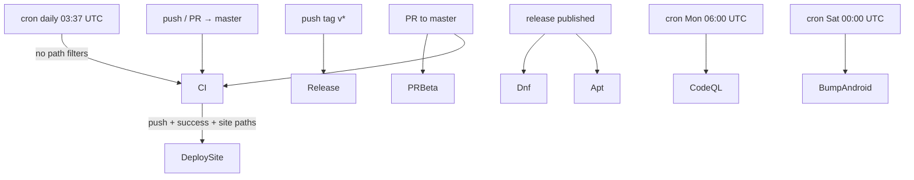
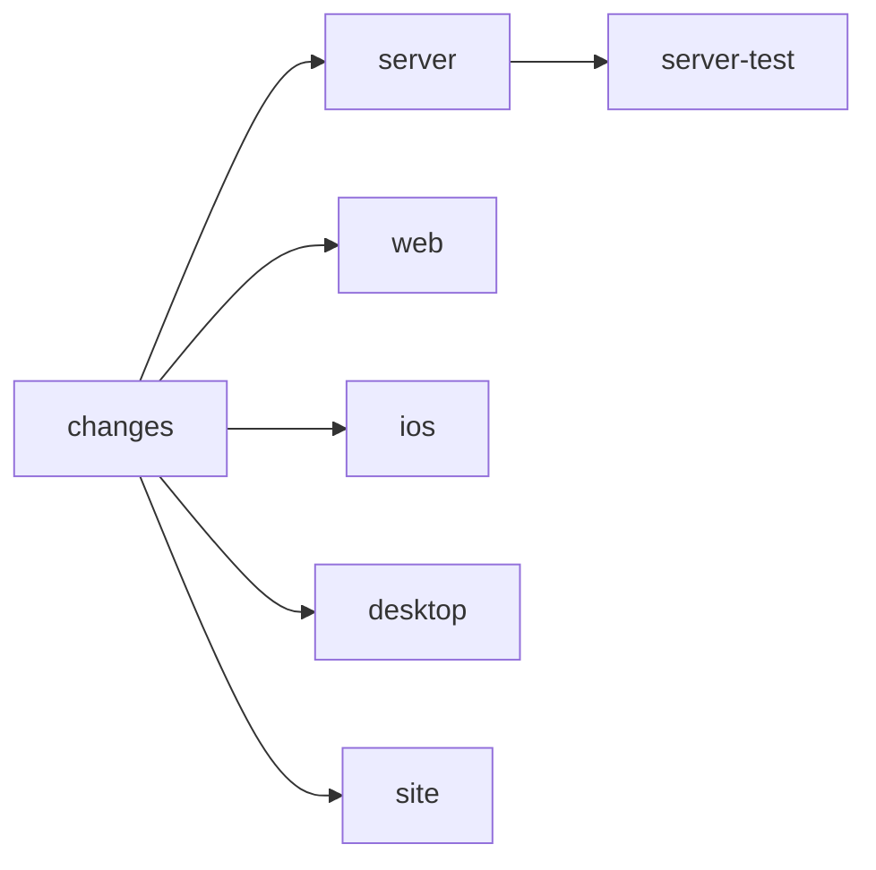
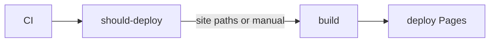
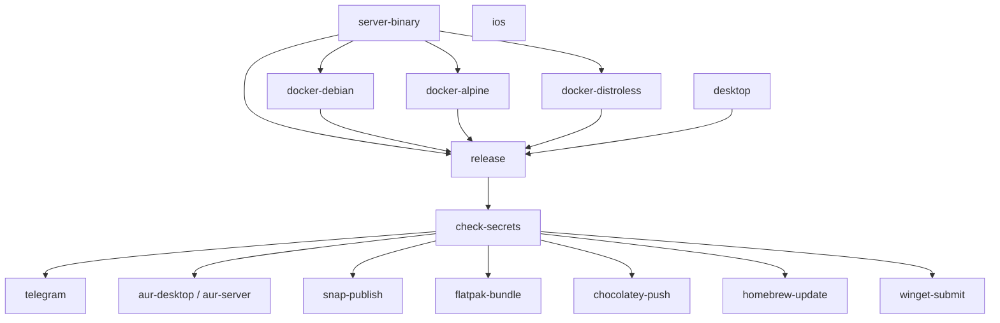

# CI/CD pipelines

Source of truth: `.github/workflows/`. This page summarizes **what each workflow does**, **when it runs**, **job deps**, and **path filters**.

---

## Overview


```mermaid
flowchart TB
  push["push / PR → master"]
  tag["push tag v*"]
  cronQ["cron Mon 06:00 UTC"]
  cronS["cron Sat 00:00 UTC"]
  cronCI["cron daily 03:37 UTC"]
  relPub["release published"]

  push --> CI
  cronCI -->|no path filters| CI
  CI -->|push + success + site paths| DeploySite
  tag --> Release
  relPub --> Apt
  relPub --> Dnf
  cronQ --> CodeQL
  cronS --> BumpAndroid
  PR["PR to master"] --> CI
  PR --> PRBeta
```

| Workflow | File | Trigger | Purpose |
|----------|------|---------|---------|
| **CI** | `ci.yml` | push → `master`, every PR, daily cron, manual | Lint/test/build per app (path-filtered, except on cron/manual) |
| **Deploy Site** | `deploy-site.yml` | after a **push**-triggered CI success on `master`, or manual | GitHub Pages (landing + docs) |
| **Release** | `release.yml` | tag `v*` | Full production release |
| **PR Beta** | `pr-beta.yml` | PR open/sync/reopen/close | Per-PR beta assets |
| **Bump Android Pin** | `bump-android-pin.yml` | weekly, or manual | PR to move `apps/android` to bedrud-android's newest release |
| **CodeQL** | `codeql.yml` | push/PR + weekly | Security analysis |
| **Apt repo** | `apt-repo.yml` | release published | `.deb` apt index on Pages |
| **DNF repo** | `dnf-repo.yml` | release published | `.rpm` dnf index |

There is **no** auto SSH deploy to a production host (`deploy-server.yml` removed) and **no**
nightly or dev **build** pipeline — nothing is published on a schedule. The daily CI cron below
only re-runs the existing checks; it produces no artifacts and deploys nothing. Android is built,
signed and released entirely in its own repo; this one only records which of those releases it
sits alongside.

---

## Path filters (what runs when)

Used by **CI** and **Deploy Site**. Compares changed files to the previous commit.

**The daily cron and a manual `workflow_dispatch` skip the filters entirely** and run every job.
A push only ever answers "what did this commit touch", so a job no path routes to is a job nobody
hears from while the commit still shows green. The unfiltered run is what bounds how long that
can last, and it is the only run proving `master` passes from scratch rather than from whichever
commit last happened to touch the right tree.

| Flag / job group | Paths that enable it |
|------------------|----------------------|
| **server** | `server/**` |
| **web** | `apps/web/**` (meeting UI; embedded in binary) |
| **site** | `apps/site/**`, **`docs/**`**, `server/**` (swagger), related workflow files |
| **desktop** | `apps/desktop/**`, `Cargo.toml`, `Cargo.lock` |
| **ios** | `apps/ios/**` |

`apps/android` has no filter and no job here. It is a git submodule pointing at
[bedrud-android](https://github.com/themadorg/bedrud-android), which lints, tests and
signs its own releases — moving the pinned commit in this repo builds nothing in this
repo. See [Bump Android Pin](#bump-android-pin-bump-android-pinyml).

**Important examples**

| Change set | CI jobs | Pages deploy |
|------------|---------|--------------|
| Only `docs/**` | **site only** | yes (if CI succeeded) |
| Only `apps/site/**` | site only | yes |
| Only `apps/web/**` | web | no* |
| Only `server/**` | server + site | yes (swagger) |
| Only `apps/android` (the pin) | **none** | no |

\*Unless `server/` or `apps/site/` / `docs/` also changed.

**Trees**

- `apps/web` → product UI inside `bedrud` / Docker  
- `apps/site` → bedrud.org landing + user docs (Pages)  
- `docs/` → **repo** developer markdown (this tree); does **not** build the Go binary  

---

## CI (`ci.yml`)

**When:** push to `master`; every pull request, whatever branch it targets; daily at 03:37 UTC;
and on manual `workflow_dispatch`. The last two run unfiltered — see
[Path filters](#path-filters-what-runs-when).

**Concurrency:** a pull request groups by ref, so a new push supersedes the run before it. Every
other event groups by **commit**, so it shares a group with nothing and is never superseded.
Grouping master by ref is how a merge landing on top of another cancelled the first one's tests,
leaving that commit with no result at all — and `cancel-in-progress: false` does not fix it,
because a third run arriving cancels the *pending* second one.

**Failure reporting:** the `Scheduled – report` job runs only on the cron. It keeps a single open
issue labelled `scheduled-ci` while `master` is failing, refreshing its body each run and closing
it once a scheduled run passes. A push or a pull request already shows a red tick to somebody who
is looking, so it stays out of those.


```mermaid
flowchart LR
  C[changes]
  C --> S[server]
  S --> ST[server-test]
  C --> W[web]
  C --> I[ios]
  C --> D[desktop]
  C --> Site[site]
```

Jobs run only if their path flag is true (except `changes`, always).

### `changes`

- Checkout + `dorny/paths-filter` → outputs: `server`, `web`, `site`, `desktop`, `ios`

### `server` (if `server`)

- Setup Go 1.26  
- Placeholder `frontend/` + LiveKit bin for `//go:embed`  
- `go vet ./...`  
- `go build ./...`

### `server-test` (if `server`, needs `server`)

- Same placeholders  
- `go test -race -count=1 ./...`

### `web` (if `web`)

- Bun install  
- `bun run check`  
- `bun run build`

### `ios` (if `ios`) — `macos-15`

- SPM resolve  
- `build-for-testing` + `test-without-building` (simulator)  
- Coverage report artifact

### `desktop` (if `desktop`)

- Rust stable + Linux Slint deps  
- `cargo build -p bedrud-desktop`  
- `cargo test -p bedrud-desktop`

### `site` (if `site`)

- Bun install  
- Copy `server/docs/swagger.json` → `public/`  
- `check` → `typecheck:astro` → `build`

---

## Deploy Site (`deploy-site.yml`)

**When:** a **push**-triggered CI run succeeded on `master`, or manual `workflow_dispatch`.

The event matters. CI also runs on a schedule, and a scheduled run carries `master` as its head
branch, so without checking `workflow_run.event` every cron would republish identical content and
file a fresh Pages deployment.


```mermaid
flowchart LR
  CI --> SD[should-deploy]
  SD -->|site paths or manual| B[build]
  B --> D[deploy Pages]
```

- **should-deploy:** if a push-triggered CI run succeeded (or manual); path check includes `apps/site/`, `docs/`, `server/`, deploy/ci workflow files  
- **build** (if site needed): GPG key export (optional secrets) → sync swagger → Astro build  
- **deploy:** `actions/deploy-pages`  

Manual dispatch always deploys.

---

## Release (`release.yml`)

**When:** push tag `v*`. **No path filters** — full matrix.


```mermaid
flowchart TB
  SB[server-binary] --> D1[docker-debian]
  SB --> D2[docker-alpine]
  SB --> D3[docker-distroless]
  I[ios]
  Desk[desktop]
  SB & D1 & D2 & D3 & Desk --> R[release]
  R --> Sec[check-secrets]
  Sec --> Tel[telegram]
  Sec --> AUR[aur-desktop / aur-server]
  Sec --> Snap[snap-publish]
  Sec --> FP[flatpak-bundle]
  Sec --> Choco[chocolatey-push]
  Sec --> Brew[homebrew-update]
  Sec --> Winget[winget-submit]
```

- **server-binary:** multi-OS packages + deb/rpm  
- **docker-\*:** push GHCR + offline `.tar.gz`  
- **ios / desktop:** full client builds (signing when secrets present)  
- **release:** GitHub Release with all artifacts  
- **Downstream** (secret-gated): Telegram, AUR, Snap, Flatpak, Chocolatey, Homebrew, WinGet  

**Android is not built here.** `release.yml` produces no Android artifact and never checks
out the submodule — bedrud-android builds and signs its own APKs in its own release
workflow. This repo only records *which* of its releases a given bedrud release sits
alongside, and that record is the submodule pointer.

The pointer still wants to be current before tagging:

```
make pin-android-stable   # checks out apps/android at the newest bedrud-android release
git add apps/android && git commit -m "chore(android): pin submodule to bedrud-android@X.Y.Z"
git tag vX.Y.Z && git push origin master vX.Y.Z
```

`bump-android-pin.yml` proposes that same commit as a PR every Saturday, so the pin is
usually already current; the manual route above is for a release cut mid-week.

---

## PR Beta (`pr-beta.yml`)

**When:** PR to `master` (open/sync/reopen/close). **Not path-filtered.**

- **closed:** delete PR beta release  
- **else:** build server (linux), web, desktop → prerelease `pr-<n>-…` → PR comment → Telegram  

---

## Bump Android Pin (`bump-android-pin.yml`)

**When:** cron `0 0 * * 6` (00:00 Saturday UTC), or manual dispatch.

`apps/android` is a submodule, and nothing else moves it — between bedrud-android
publishing a release and somebody running `make pin-android-stable`, this repo keeps
referencing whatever it was last pinned to. This job closes that gap:

- Resolve the newest **release** of bedrud-android (not the newest tag: a tag is pushed
  before that repo's signed build is dispatched and approved, so a tag can exist for days
  with nothing built behind it). Pre-releases count — beta and stable of one tag are the
  same commit, built and signed identically.
- Compare it to the commit currently pinned in the index; stop if they match.
- Otherwise write the new gitlink and open `chore/pin-android-<tag>` as a PR.

It never merges, and it never touches an open bump PR it already created. Because the PR
is opened with `GITHUB_TOKEN`, GitHub does not run workflows on it — which costs nothing
here, since no job in this repo builds Android anyway.

---

## CodeQL (`codeql.yml`)

**When:** push/PR `master`, weekly Monday 06:00 UTC.

- Init CodeQL → Go setup + Bun stub for embed → analyze  

---

## Apt / DNF (`apt-repo.yml`, `dnf-repo.yml`)

**When:** GitHub Release `published` (or apt manual dispatch with tag).

- Pull packages from release  
- Rebuild signed repo on `packages` branch / Pages (apt)  
- Requires GPG secrets  

---

## Local equivalents

```bash
# server
cd server && go vet ./... && go build ./... && go test -race -count=1 ./...

# web
cd apps/web && bun run check && bun run build

# site
cd apps/site && bun run check && bun run typecheck:astro && bun run build

# desktop
cargo test -p bedrud-desktop

# android (submodule — init it first if you cloned without --recurse-submodules).
# No job in this repo builds it; bedrud-android runs its own lint and tests.
git submodule update --init apps/android
cd apps/android && ./gradlew lint testDebugUnitTest

# prod-ish binary
make build-dist
```

LiveKit embed placeholder (CI): `mkdir -p server/internal/livekit/bin && touch server/internal/livekit/bin/livekit-server`

---

## Quick reference: “what will run?”

1. Open the PR/push file list.  
2. Match paths to the table under **Path filters**.  
3. CI = only matching jobs — on a push or a pull request. The daily cron and a manual
   `workflow_dispatch` ignore the table and run everything.  
4. Pages = after a **push**-triggered CI run, only if site/docs/server paths hit (or manual).  
5. Full production everything = `git tag vX.Y.Z && git push --tags`.  
